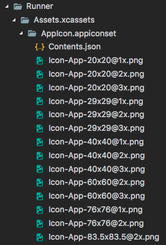

# 2.4 资源管理
&ensp;&ensp;Flutter APP安装包中会包含代码和 assets（资源）两部分。Assets是会打包到程序安装包中的，可在运行时访问。常见类型的assets包括静态数据（例如JSON文件）、配置文件、图标和图片（JPEG，WebP，GIF，动画WebP / GIF，PNG，BMP和WBMP）等。
## 指定 assets
&ensp;&ensp;和包管理一样，Flutter也使用`pubspec.yaml`文件来管理应用程序所需的资源，举个例子:
```yaml
flutter:
  assets:
    - assets/my_icon.png
    - assets/background.png
```
&ensp;&ensp;assets指定应包含在应用程序中的文件， 每个asset都通过相对于`pubspec.yaml`文件所在的文件系统路径来标识自身的路径。asset的声明顺序是无关紧要的，asset的实际目录可以是任意文件夹（在本示例中是assets文件夹）。在构建期间，Flutter将asset放置到称为 asset bundle 的特殊存档中，应用程序可以在运行时读取它们（但不能修改）。

## 加载 assets
&ensp;&ensp;可以通过AssetBundle对象访问其asset 。有两种主要方法允许从Asset bundle中加载字符串或图片（二进制）文件。

## 加载 图片
&ensp;&ensp;类似于原生开发，Flutter也可以为当前设备加载适合其分辨率的图像。
   
**声明分辨率相关的图片**
   
&ensp;&ensp;[AssetImage](https://docs.flutter.io/flutter/painting/AssetImage-class.html) 可以将asset的请求逻辑映射到最接近当前设备像素比例（dpi）的asset。为了使这种映射起作用，必须根据特定的目录结构来保存asset：
- …/image.png
- …/2x/image.png
- …/3x/image.png

## 加载图片
&ensp;&ensp;要加载图片，可以使用`AssetImage`类。例如，我们可以从上面的asset声明中加载背景图片：

```dart
Widget build(BuildContext context) {
  return new DecoratedBox(
    decoration: new BoxDecoration(
      image: new DecorationImage(
        image: new AssetImage('graphics/background.png'),
      ),
    ),
  );
}
/// 注意，AssetImage 并非是一个widget， 它实际上是一个ImageProvider，有些时候你可能期望直接得到一个显示图片的widget，那么你可以使用Image.asset()方法，如：
Widget build(BuildContext context) {
  return Image.asset('graphics/background.png');
}
```
## 特定平台 assets
&ensp;&ensp;上面的资源都是flutter应用中的，这些资源只有在Flutter框架运行之后才能使用，如果要给我们的应用设置APP图标或者添加启动图，那我们必须使用特定平台的assets。
### 设置APP图标
&ensp;&ensp;更新Flutter应用程序启动图标的方式与在本机Android或iOS应用程序中更新启动图标的方式相同。
- Android
   
&ensp;&ensp;在Flutter项目的根目录中，导航到.../android/app/src/main/res目录，里面包含了各种资源文件夹（如mipmap-hdpi已包含占位符图像“ic_launcher.png”，见图2-8）。 只需按照[Android开发人员指南](https://developer.android.com/guide/practices/ui_guidelines/icon_design_launcher.html#size)中的说明， 将其替换为所需的资源，并遵守每种屏幕密度（dpi）的建议图标大小标准。
   
<!-- &ensp;&ensp; -->

<!-- <div style='display:flex;justify-content:center;width:100%'><div> -->
   
- IOS
   
&ensp;&ensp;在Flutter项目的根目录中，导航到.../ios/Runner。该目录中Assets.xcassets/AppIcon.appiconset已经包含占位符图片（见图2-9）， 只需将它们替换为适当大小的图片，保留原始文件名称。
<!-- <div style='display:flex;justify-content:center;width:100%'><div> -->

   
   
### 更新启动页
&ensp;&ensp;在Flutter框架加载时，Flutter会使用本地平台机制绘制启动页。此启动页将持续到Flutter渲染应用程序的第一帧时。
> 注意: 这意味着如果您不在应用程序的main()方法中调用runApp 函数 （或者更具体地说，如果您不调用`window.render`去响应`window.onDrawFrame`）的话， 启动屏幕将永远持续显示。

- Android
&ensp;&ensp;要将启动屏幕（splash screen）添加到您的Flutter应用程序， 请导航至`.../android/app/src/main`。在`res/drawable/launch_background.xml`，通过自定义drawable来实现自定义启动界面（你也可以直接换一张图片）。
- IOS
&ensp;&ensp;要将图片添加到启动屏幕（splash screen）的中心，请导航至`.../ios/Runner`。在A`ssets.xcassets/LaunchImage.imageset`， 拖入图片，并命名为`LaunchImage.png`、`LaunchImage@2x.png`、`LaunchImage@3x.png`。 如果你使用不同的文件名，那您还必须更新同一目录中的`Contents.json`文件，图片的具体尺寸可以查看苹果官方的标准。
   
&ensp;&ensp;您也可以通过打开Xcode完全自定义storyboard。在`Project Navigator`中导航到`Runner/Runner`然后通过打开`Assets.xcassets`拖入图片，或者通过在`LaunchScreen.storyboard`中使用`Interface Builder`进行自定义，如图2-11所示。
<!-- <div style='display:flex;justify-content:center;width:100%'><div> -->

